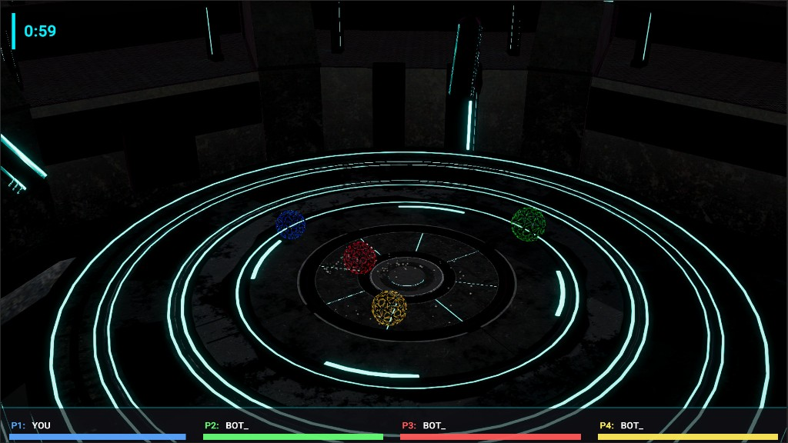

# viverse-unity

VIVERSE Unity SDK distribution and samples.

- [`unity-sdk/`](unity-sdk/) — standalone / downloadable SDK
- [`samples/neon-sumo/`](samples/neon-sumo/) — self-contained Neon Sumo sample (SDK already installed)

Play the hosted Neon Sumo demo: [https://www.viverse.com/HwW3QU2](https://www.viverse.com/HwW3QU2)

To run the sample locally, create a game in [VIVERSE Studio](https://studio.viverse.com/), then paste the App ID into `NeonSumoConfig` in the Unity Editor. See the [sample README](samples/neon-sumo/README.md).