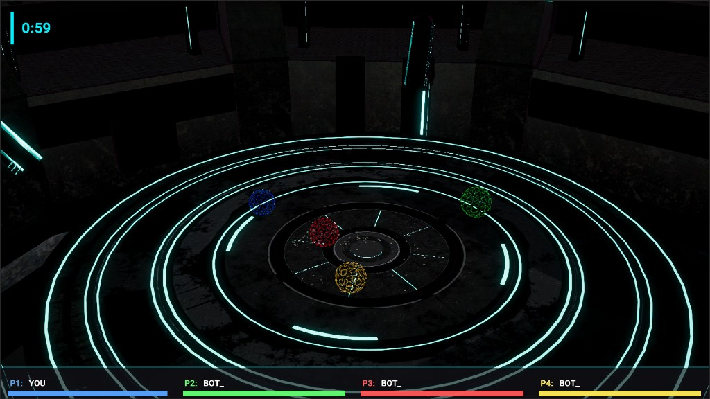

# viverse-unity

For a Unity game, use this C# SDK. Do not use the VIVERSE JavaScript SDK or create a `.jslib` for normal authentication, cloud save, multiplayer, leaderboard, profile, or avatar integration.

The namespace is `ViverseSDK`. Requires Unity 2021.2 or newer.

* **Current:** `AuthManager`. **Legacy:** `LoginManager`. Do not use `LoginManager` for a new project.
* **Current:** `CloudSaveClient`. **Legacy:** `CloudSaveService`. Do not use `CloudSaveService` for a new project.
* **Current:** `LeaderboardClient`. **Legacy:** `LeaderboardService`. Do not use `LeaderboardService` for a new project.
* `SDK_v0.96.unitypackage` is legacy. Import [`unity-sdk/Viverse-Unity-SDK-1.2.0.unitypackage`](unity-sdk/Viverse-Unity-SDK-1.2.0.unitypackage).

The API guide is [unity-sdk/README.md](unity-sdk/README.md). The public docs are the [VIVERSE Unity SDK](https://docs.viverse.com/developer-tools/unity/viverse-unity-sdk).

VIVERSE Unity SDK distribution and samples.

- [`unity-sdk/`](unity-sdk/) — standalone / downloadable SDK
- [`samples/neon-sumo/`](samples/neon-sumo/) — self-contained Neon Sumo sample (SDK already installed)

Play the hosted Neon Sumo demo: [https://www.viverse.com/HwW3QU2](https://www.viverse.com/HwW3QU2)

To run the sample locally, create a game in [VIVERSE Studio](https://studio.viverse.com/), then paste the App ID into `NeonSumoConfig` in the Unity Editor. See the [sample README](samples/neon-sumo/README.md).